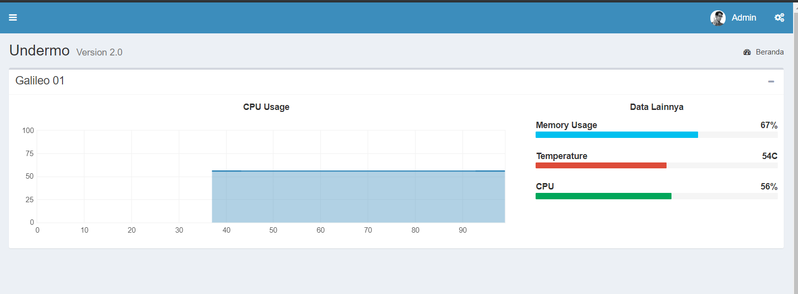
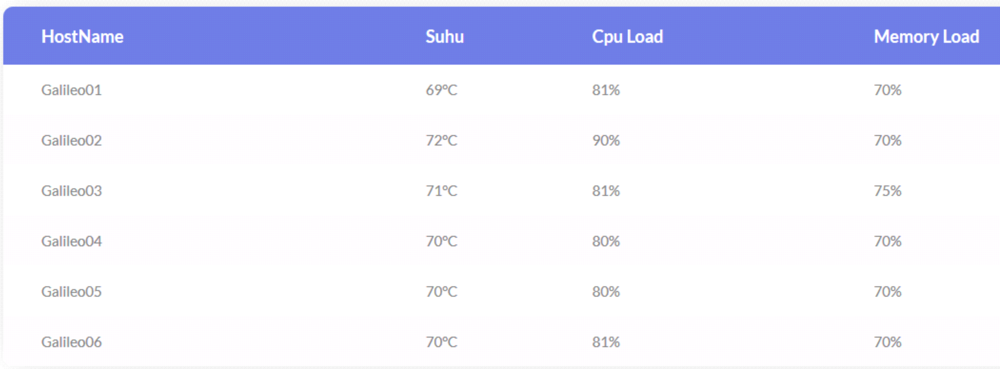
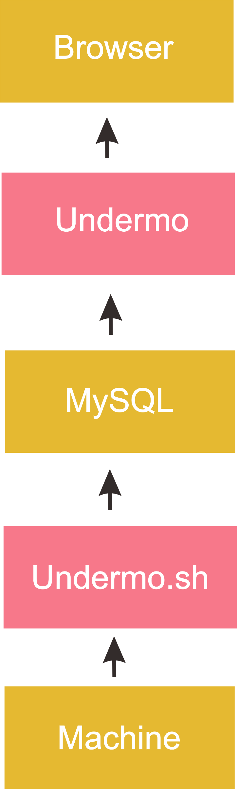
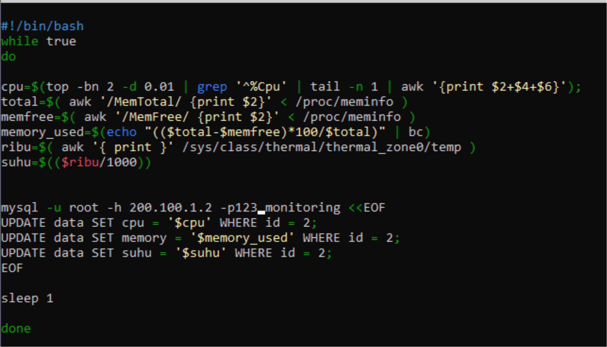

Introduction
============

**UNDERMO** -- is a **realtime** monitoring web based application made only for intel galileo.

## Image example
undermo V2.1 UI 



undermo V1.0 UI
 

## How it works?



undermo.sh fetch data from machine > give it to mysql database > undermo fetch data from database > show it to browser
## Documentation & Installation Guide

Before we begin, first open your galileo, and make a user for mysql database, for example i'm gonna make a user called **editor** with password **123edit**

- Download undermo and extract it, there will be a folder named undermo
- Remote your galileo
- open undermo folder and look for undermo.sh, then move it to /etc/init.d
- edit the bottom of the file like this

```
mysql -u <editor> -h <server ip address/domain> -p<123edit> monitoring <<EOF
UPDATE data SET cpu = '$cpu' WHERE id = 1;
UPDATE data SET memory = '$memory_used' WHERE id = 1;
UPDATE data SET suhu = '$suhu' WHERE id = 1;
EOF
```



- grant permission to the file in order to be able to run it

```
chmod +x undermo.sh
```
- login to your database and create new database called **monitoring**

```
CREATE DATABASE monitoring ; > Enter
```

- create new table called **data**

```
CREATE TABLE data( id int(3) primary key, cpu float(3), memory int(3), suhu int(3) ); > Enter
```

- now we're gonna enter some random data to cpu, memory, and suhu. But remember not to enter random data for the id, so undermo.sh can change the data later

```
INSERT INTO data VALUES ('1', '30', '23', '56'); > Enter
```

- grant permission to **editor** user

```
GRANT ALL PRIVILEGES ON *.* TO ‘editor’@’server ip addess / domain' IDENTIFIED BY ‘123edit’ > Enter
```

- now run the file!

```
./etc/init.d/undermo.sh
```

- now open undermo folder, then edit **functions.php** at the top of the code

```
$conn = mysqli_connect("server ip", "editor", "123edit", "monitoring");
```

- move the folder to your webserver directory
- finally open your browser, then type your server ip / domain in the searchbar

```
your-ip-or-domain-server.com/undermo
```


